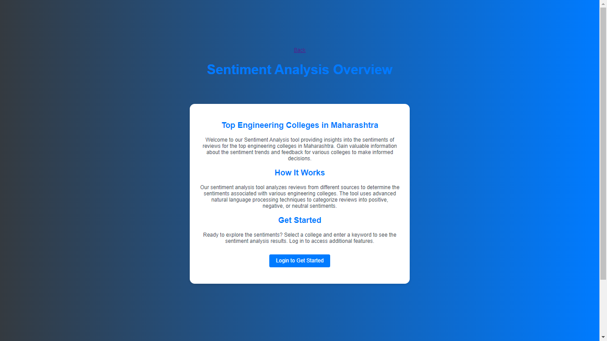
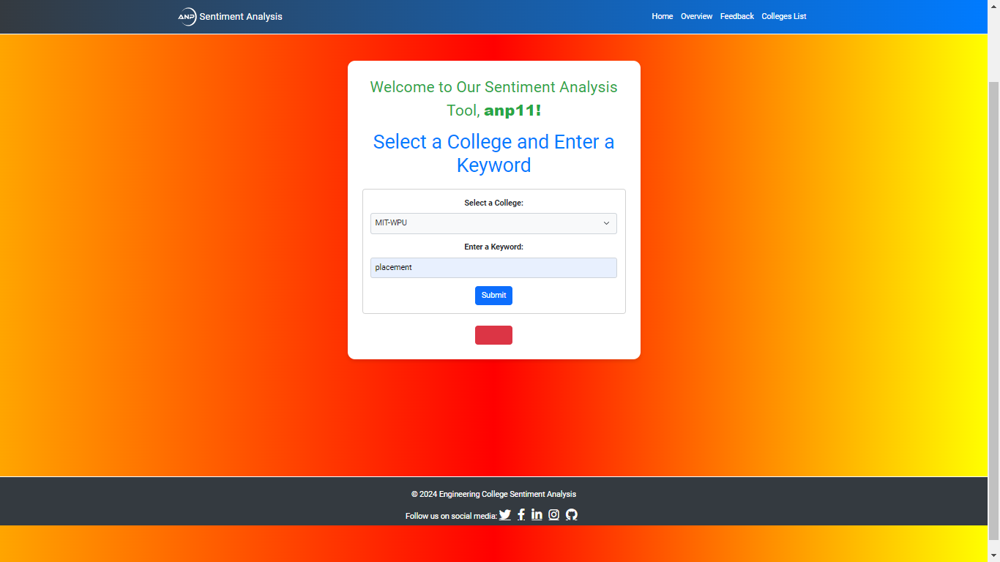
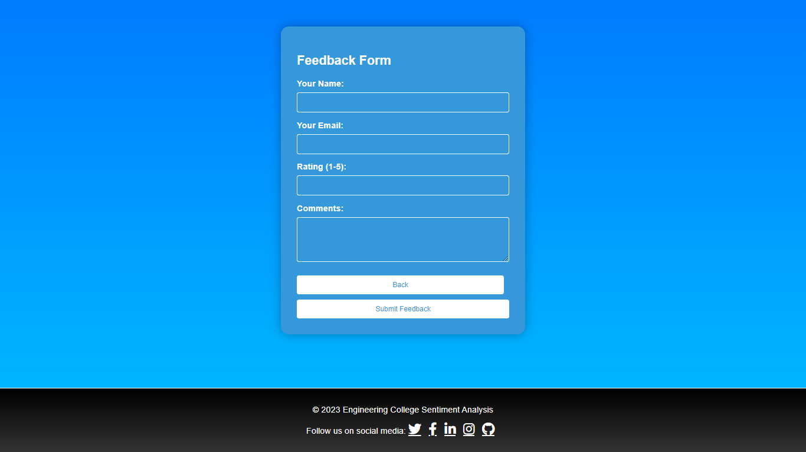
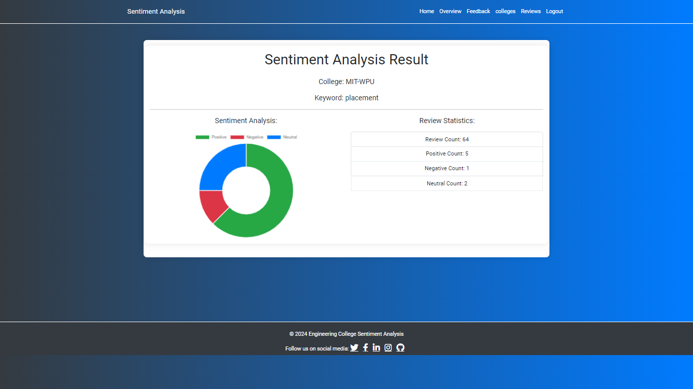
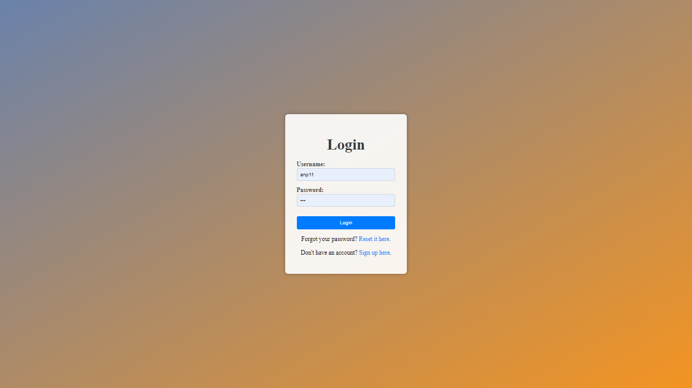
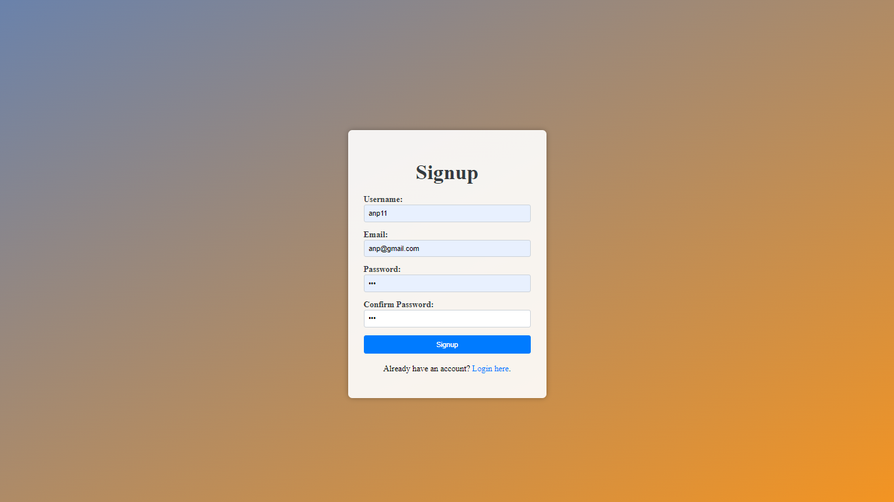

# College Sentiment Analysis Web Application

## Overview

This project is a Flask web application designed to collect, analyze, and visualize sentiment feedback about different colleges. Users can submit their feedback, view sentiment analysis results, and manage their accounts.

## Features

- **User Authentication**: Users can sign up, log in, reset passwords, and manage their sessions.
- **Feedback Submission**: Users can submit feedback about colleges, including ratings and comments.
- **Sentiment Analysis**: Sentiment analysis is performed on the feedback using pre-trained SVM and logistic regression models.
- **Data Visualization**: Sentiment analysis results are displayed as pie charts.
- **Email Notifications**: Users can receive password reset emails.
- **Error Handling**: Custom error pages for 404 and 500 errors.

## Installation

1. Clone the repository:

    ```bash
    git clone https://github.com/yourusername/college-sentiment-analysis.git
    cd college-sentiment-analysis
    ```

2. Create a virtual environment and activate it:

    ```bash
    python -m venv venv
    source venv/bin/activate   # On Windows use `venv\Scripts\activate`
    ```

3. Install the required packages:

    ```bash
    pip install -r requirements.txt
    ```

4. Set up the database:

    ```bash
    python -c "from app import init_db; init_db()"
    ```

5. Run the application:

    ```bash
    flask run
    ```

6. Open a browser and navigate to `http://127.0.0.1:5000/`.


## Screenshots
### Welcome Page



### Home Page



### Feedback Form



### Sentiment Analysis Results



### User Authentication



### User Authentication


## Project Structure
.
├── app.py                      # Main Flask application file
├── forms.py                    # WTForms definitions for handling form validation
├── requirements.txt            # List of dependencies for the project
├── templates                   # Directory containing HTML templates
│   ├── index.html
│   ├── feedback.html
│   ├── result.html
│   ├── login.html
│   ├── signup.html
│   ├── forgot_password.html
│   ├── reset_password.html
│   ├── error.html
│   └── reviews.html
├── static                      # Directory containing static files like CSS, JavaScript, images
│   ├── css
│   └── js
├── svm_model.pkl               # Pre-trained SVM model for sentiment analysis
├── lr_model.pkl                # Pre-trained Logistic Regression model for sentiment analysis
├── vectorizer.pkl              # CountVectorizer used for feature extraction
└── sentiment_result.csv        # Dataset used for sentiment analysis


## Usage

### User Authentication

- **Sign Up**: Create a new account.
- **Log In**: Log into an existing account.
- **Reset Password**: Request a password reset email if you forget your password.

### Feedback Submission

Navigate to the feedback page and submit feedback by selecting a college, entering a keyword, rating, and comments.

### Sentiment Analysis

Go to the results page, select a college and enter a keyword to see the sentiment analysis results for feedback containing that keyword.

### Sentiment Reviews

Visit the sentiment reviews page to see a list of all reviews and their sentiments.

## Dependencies

- Flask
- Flask-Mail
- Flask-WTF
- Werkzeug
- Pandas
- Matplotlib
- Scikit-learn
- SQLite

## License

This project is licensed under the MIT License. See the [LICENSE](LICENSE) file for details.

## Contact

For any questions or feedback, please contact [namgareavadhut@gmail.com](mailto:namgareavadhut@gmail.com).


